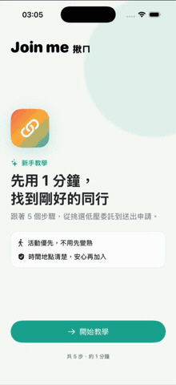
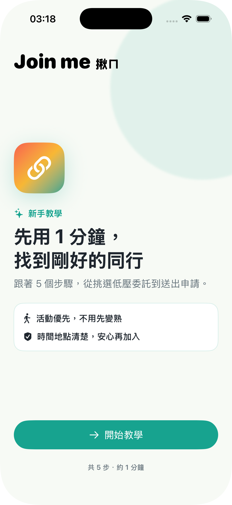
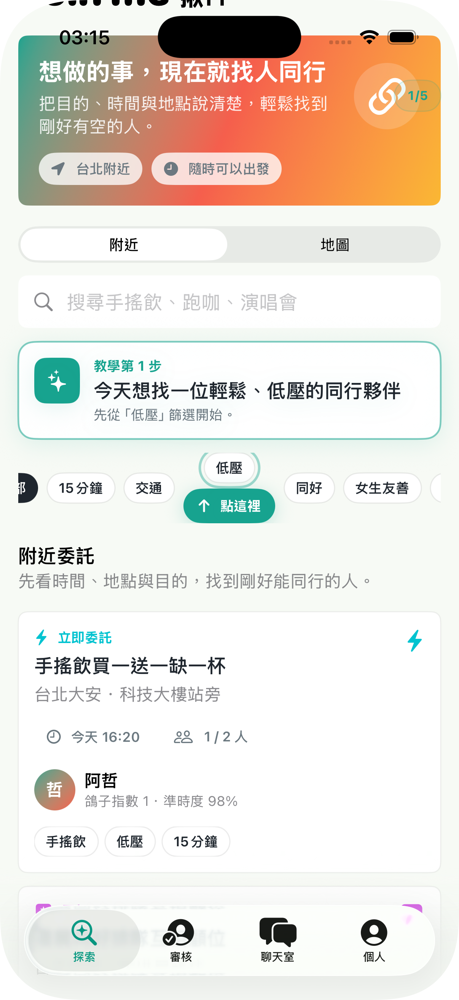
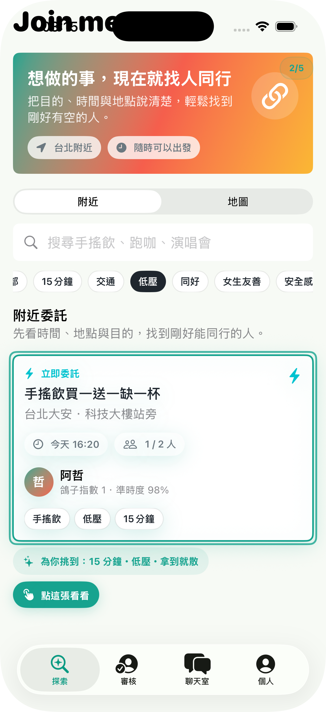
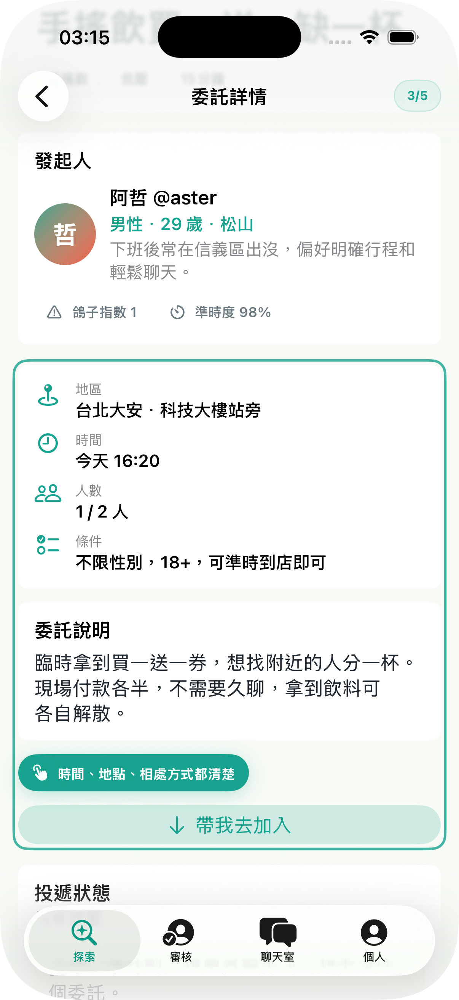
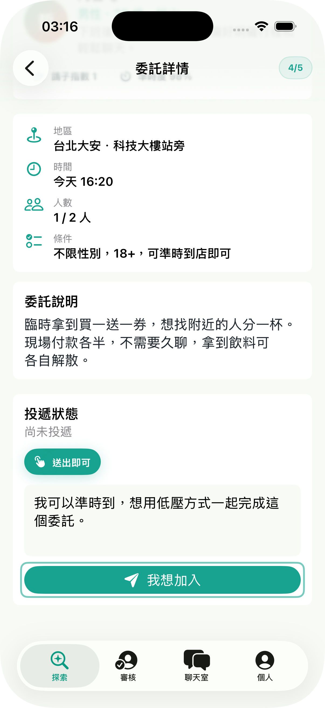
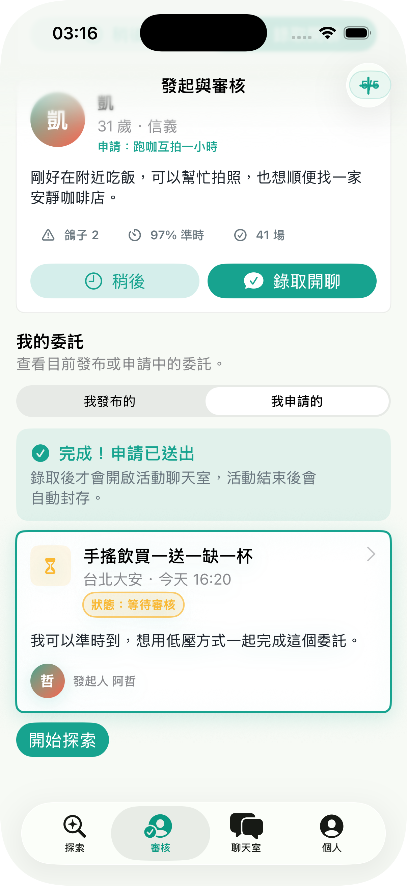

# Join Me 揪ㄇ

2026 iOS Summer Camp

網站: https://littlefish-coder.github.io/join-me/

Join Me 是一款以活動為核心的輕社交 App。使用者可以發布或加入「委託」，快速找到一起完成當下活動的夥伴。

無論是買一送一湊單、看展、拍照、運動或參加演唱會，使用者不必先建立長期關係，也不必承受傳統交友軟體帶來的社交壓力。Join Me 希望讓面對面的揪團，就像在線上遊戲找隊友一樣簡單。

## Demo

  

  
  
  

  
  
  

## 產品理念

打造「無壓力」的當下社交。

Join Me 強調活動優先，而非關係優先。每次互動都有清楚的目的、時間與結束點，使用者只需要享受當下有人同行，不必刻意創造深刻或長期的連結。

## 核心功能

- 發布委託：設定活動內容、地區、時間、人數及參與條件
- 探索委託：透過地圖、關鍵字與標籤尋找活動
- 申請與審核：參與者提出加入申請，由發起人確認人選
- 活動聊天室：錄取後進入活動專屬聊天室
- 自動歸檔：活動結束後關閉臨時聊天室，降低後續社交壓力
- 信用與互評：透過出席紀錄及活動後互評建立安全感

## 文件

- [產品理念與功能規劃](doc/PRODUCT.md)
- [AI 開發規範](AGENTS.md)
